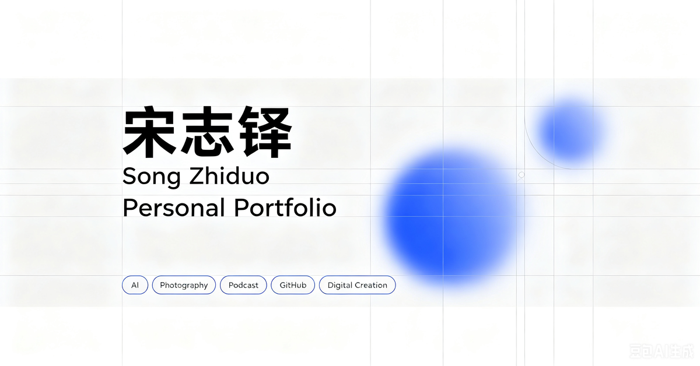

# 🌐 Song Zhiduo · Personal Portfolio

> A modern personal portfolio showcasing my projects, learning journey, and digital creations.



---

## 🚀 Live Demo

🌍 **Website**

https://songzhiduo-portfolio-d3a62b54c6c-1453799877.tcloudbaseapp.com

💻 **GitHub Repository**

https://github.com/rainbowb400-bot/resume-website

---

## 📖 About

This project is my personal portfolio website, built to showcase my projects, learning journey, and continuous growth.

Rather than focusing only on technical skills, the portfolio highlights:

- AI Learning
- Knowledge Management
- Content Creation
- Personal Projects
- Digital Productivity
- Continuous Learning

The website follows an **Editorial Minimal Tech** direction — the typographic discipline of Swiss / International Typographic Style (12-column grid, editorial type hierarchy, hairline borders, generous whitespace) fused with a modern minimal tech feel (brand blue, clean components, responsive interactions).

---

## ✨ Features

- 🌐 Responsive Design
- 📱 Mobile Friendly
- 🎙 Podcast Showcase
- 🧠 Knowledge Management Project
- 📷 Photography Section
- 🚀 Tencent Cloud Deployment
- 🔍 SEO Optimization
- 🖼 Open Graph Preview
- ⚡ Lazy Loading Images
- 🖼 WebP 响应式封面（体积减少约 98%）
- 🖼 WebP 头像压缩（体积减少约 99%）
- 📦 成果导向内容呈现（"产出"行）
- 🔤 编辑式排版系统（章节编号 01–08、kicker 标签、字号层级）
- 📐 12 列响应式网格（1200px 容器）
- 🕰 工作经历时间轴
- 🖼 项目 Editorial Row（非对称双栏 + 细框 + 图注）
- 🎨 图片灰度 → 彩色 hover（触屏设备自动跳过）
- 🎨 Minimal UI

---

## 🛠 Tech Stack

| Category | Technology |
|----------|------------|
| Frontend | HTML5 · CSS3 · JavaScript |
| Version Control | Git · GitHub |
| Deployment | GitHub Pages · Tencent CloudBase |
| Design | Figma · Photoshop |
| Productivity | Obsidian · ChatGPT |

---

## 📂 Project Structure

```text
.
├── assets
│   ├── covers
│   ├── favicon.png
│   └── preview.png
├── index.html
├── style.css
├── script.js
├── README.md
└── PROJECT_CONTEXT.md
```

---

## 📌 Featured Projects

### 🌐 Personal Portfolio Website

A responsive portfolio website designed and developed from scratch.

---

### 🎙 Original Podcast

Podcast creation, publishing and content sharing.

---

### 🧠 Knowledge Management

Personal knowledge management system built with Obsidian.

---

### 📷 Photography

Photography learning and creative practice.

---

## 📈 Development Progress

### Version 1.0

- Website Structure
- Responsive Layout
- Navigation
- Project Sections

### Version 1.5

- Git
- GitHub
- GitHub Pages
- Tencent Cloud Deployment

### Version 2.0

- Portfolio Covers
- SEO
- Open Graph
- Footer
- Lazy Loading
- Code Refactoring

### Version 3.0 — Editorial Minimal Tech Redesign (2026-08)

- 视觉基础层：设计令牌、Inter 字体、排版层级、区块节奏
- 章节标签系统（01–08 / kicker + h2）
- About 编辑式双栏（头像暂移除，资产保留待更换照片）
- 工作经历静态时间轴（左年份 / 中线 / 右内容）
- 项目经历 Editorial Row：非对称双栏 + 细框 + 图注（4 个项目全部完成）
- 技能区 12 列网格
- 教育 / 证书 / GitHub / 联系区块统一
- 主容器 900px → 1200px，适配 12 列网格
- 交互：图片灰度 → 彩色 hover

---

## 🎯 Roadmap

- [ ] AI Agent Project
- [ ] Obsidian Showcase
- [ ] Drone Project
- [ ] More Portfolio Projects
- [ ] Photography Cover（摄影项目封面）

---

## 👤 About Me

Quality Management graduate passionate about:

- Artificial Intelligence
- Knowledge Management
- Workflow Optimization
- Content Creation
- Digital Products

Currently building projects that combine technology, creativity, and lifelong learning.

---

## 📬 Contact

Portfolio

https://songzhiduo-portfolio-d3a62b54c6c-1453799877.tcloudbaseapp.com

GitHub

https://github.com/rainbowb400-bot

Podcast

https://www.xiaoyuzhoufm.com/podcast/6a0ac9dcbf4b2a18244b3b80

---

## 📄 License

This project is released under the MIT License.

---

⭐ Thanks for visiting my portfolio.
